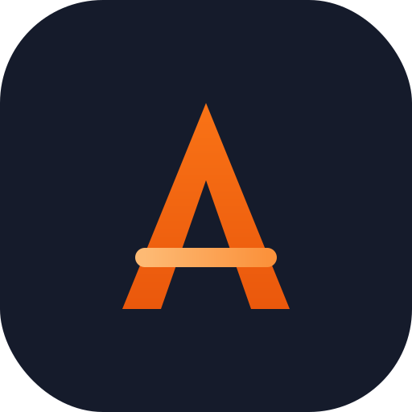
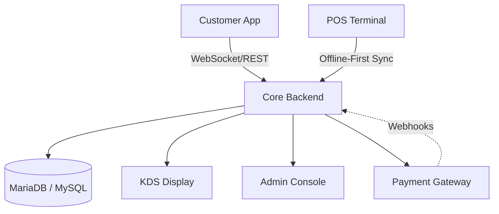

# <div align="center"><br>Café OS</div>

<div align="center">
  <h3>The Operating System for Modern Gastronomy</h3>
  <p><i>Premium. Scalable. Offline-First.</i></p>
</div>

<div align="center">
  
  
  
  
</div>

---

## 🌟 Why Café OS?

Stop managing your restaurant with fragmented spreadsheets and slow tools. **Café OS** is a unified digital ecosystem designed to handle high-growth kitchen operations with elegance.

### 💎 Premium Experience
- **Glassmorphic UI:** A stunning, modern interface inspired by the latest design trends.
- **Micro-Animations:** Fluid transitions that make the software feel "alive" and responsive.
- **Dark Mode Default:** Gentle on the eyes for late-night shifts.

---

## 🛠️ Feature Ecosystem

| Role | Core Capability | Highlight |
| :--- | :--- | :--- |
| **👑 Admin** | Enterprise Control | Real-time AI analytics & multi-outlet management. |
| **⚡ POS** | High-Speed Billing | Offline-first PWA that works without internet. |
| **🍳 Kitchen** | Order Orchestration | Visual KDS (Kitchen Display System) for chefs. |
| **🍔 Customer** | Direct Ordering | Interactive menu & real-time order tracking. |
| **🛵 Rider** | Fleet Management | Precise delivery route optimization. |

---

## 📐 System Architecture



---

## 🚀 Instant Deployment

Deploying Café OS is as simple as it gets. Follow these steps to get your kitchen running in minutes:

### 1. Requirements
- PHP 8.1+
- MySQL 5.7+ / MariaDB
- Web Server (Apache/Nginx) with `.htaccess` support

### 2. Setup
```bash
# Clone the repository
git clone https://github.com/allumnova/CafeOS.git

# Initialize configuration
cp .env.example .env

# Import Database
mysql -u your_user -p cafes_db < data/schema.sql
```

### 3. Live Demo
Check out the running instance here: [**cafeos.allumnova.in**](https://cafeos.allumnova.in)

---

## 🎯 Our Roadmap
- [ ] **AI Inventory Prediction:** Forecast stock needs based on sales history.
- [ ] **Multi-Language Support:** Adding Spanish and Arabic translations.
- [ ] **Advanced Payroll:** Integrated staff attendance & automated payouts.

---

## 🤝 Community & Support

We are building a community around open-source restaurant tech. 
- 📢 **Discussions:** Feel free to open an issue for questions.
- 🛠️ **Contributors:** Read our [CONTRIBUTING.md](CONTRIBUTING.md) for guidelines on how to get started.
- 📄 **License:** MIT Licensed - Free to use and modify.

<div align="center">
  <p>Built with ❤️ by <a href="https://allumnova.in"><b>Allumnova</b></a></p>
</div>
